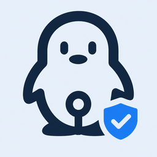

<p align="center">
  
</p>

<h1 align="center">QQ 官方机器人适配器</h1>

<p align="center"><strong>基于 QQ 官方能力，为 MaiBot 提供单聊、群聊与频道消息接入</strong></p>

<p align="center">
  
  
  
  
</p>

<p align="center">消息接收 · 自然回复 · 图片与表情 · 语音与文件 · 自艾特识别 · 断线恢复</p>

---

## 核心功能

- 在 QQ 单聊、群聊、文字子频道和频道私信中使用 MaiBot。
- 接收文字、图片、表情、语音、视频和文件，并保留可供 MaiBot 使用的媒体内容。
- 发送文字、图片和表情；表情会按图片消息发送，不会显示为无效的 `[表情]` 文本。
- 自动判断群聊消息是否真正艾特当前机器人，无需在插件配置里重复填写机器人 ID。
- 自动读取 MaiBot 的机器人昵称，并在聊天上下文中保留 `@机器人昵称`，避免艾特信息丢失。
- 自动处理重复事件、短时断线和被动回复时效，减少重复回复与串群回复。

> 实际可用场景取决于机器人在 QQ 开放平台获得的权限。快速创建的私人机器人通常只供创建者使用，是否支持群聊、频道和全量消息以开放平台页面显示为准。

## 快速启用

### 1. 创建 QQ 机器人

打开 [QQ 机器人开放平台](https://q.qq.com/qqbot/openclaw/)，创建机器人并妥善保存 `AppID` 与 `AppSecret`。

> **安全提醒：** AppSecret 等同于机器人密码，请注意安全保存。

### 2. 安装插件

将本仓库放入 MaiBot 的 `MaiBot/plugins/` 目录，MaiBot 会根据清单安装依赖。

### 3. 填写插件配置

在 MaiBot WebUI 的插件配置中只需填写：

| 配置项 | 内容 |
| --- | --- |
| 启用适配器 | 开启 |
| AppID | QQ 开放平台显示的 AppID |
| AppSecret | 与 AppID 对应的 AppSecret |

聊天名单过滤默认关闭，不配置即可正常使用。需要限制允许接入的群或用户时，再启用“聊天过滤”并填写 QQ 官方 OpenID（注意这里不是单纯的群号和QQ号，请根据实际日志显示的OpenID填写）。

### 4. 设置 MaiBot 主账号

平台名称仍然使用 `qq`。先启动一次插件，在日志中找到：

```text
QQ 官方 WebSocket 已就绪: ... self_id=机器人自身ID
```

随后在 MaiBot 的 `config/bot_config.toml` 中填写：

```toml
[bot]
platform = "qq"
qq_account = "日志中的 self_id"
```

插件会直接使用 `READY.user.id` 判断入站消息是否艾特自己；`qq_account` 仍需填写，是因为 MaiBot 主程序还会用它标记机器人自己发送的消息。不要把 AppID、QQ 号或 OneBot v11 的机器人 QQ 号填到这里。

机器人显示名称会从 MaiBot 的 `bot.nickname` 自动读取。例如昵称为 `みう` 时，群聊中的机器人艾特会以 `@みう 消息内容` 进入聊天上下文，无需在插件配置中再次填写名称或机器人 ID。

### 5. 开启群聊全量消息

如需使用群聊功能，需要由群主进入 QQ 群设置，选择当前使用的 QQ 机器人，将“机器人可获取的群聊消息范围”设置为“获取群内全部消息”。未开启时，机器人只能收到平台允许范围内的消息，无法正常参与完整群聊。


> 该设置只能由群主操作，并且需要对每个使用机器人的群分别设置。

### 6. 重启并验证

重启 MaiBot，确认日志出现“QQ 官方 WebSocket 已就绪”。建议依次测试：

1. 单聊发送普通文字。
2. 群聊艾特机器人并发送文字。
3. 发送普通图片和 QQ 表情/贴纸。
4. 让 MaiBot 分别回复纯图片、纯表情和图文消息。

## UserID / GroupID 与 OneBot v11 的区别

> **特别注意：本插件中的 UserID 与 GroupID 来自 QQ 官方 OpenID 体系，不是 OneBot v11 的数字 QQ 号和数字群号；两套 ID 不能互换。**

| MaiBot 字段 / 用途 | QQ 官方适配器填写的值 | OneBot v11 常见值 |
| --- | --- | --- |
| UserID / 单聊用户 | `user_openid` | 数字 QQ 号 |
| UserID / 群内成员 | `member_openid` | 数字 QQ 号 |
| GroupID / 群聊目标 | `group_openid` | 数字群号 |
| 机器人自身 | WebSocket `READY.user.id` | 机器人数字 QQ 号 |

这些 OpenID 由 QQ 官方事件返回，通常是不可读字符串。聊天过滤中的私聊名单填写 `user_openid`，群聊名单填写 `group_openid`，全局屏蔽用户按场景填写 `user_openid` 或 `member_openid`。

## 消息能力

| 场景 | 接收 | 发送 |
| --- | --- | --- |
| QQ 单聊 | 文字、图片、表情、语音、视频、文件 | 文字、图片、表情、语音、视频、文件、结构化消息 |
| QQ 群聊 | 艾特消息、全量消息及其附件 | 文字、图片、表情、语音、视频、文件、结构化消息 |
| 文字子频道 | 艾特消息、全量消息及附件 | 文字、图片、Markdown、Ark、Embed |
| 频道私信 | 文字及附件 | 文字、图片、Markdown、Ark、Embed |

QQ群与单聊中的表情使用图片富媒体发送。纯图片或纯表情回复不会再额外发送 `[图片]`、`[表情]` 占位文字。入站图片和表情会保留原始二进制供 MaiBot 识别；下载失败时降级为对应的媒体摘要，普通文件仍保留文件信息。

## 日志与排错

插件按影响程度区分日志级别，正常运行时无需关注逐条协议细节：

| 级别 | 记录内容 |
| --- | --- |
| `INFO` | 插件启停、WebSocket 就绪、恢复连接和聊天过滤结果 |
| `WARNING` | 可自动恢复的异常，例如单次心跳失败、无效事件或附件降级 |
| `ERROR` | WebSocket 连接、消息发送、连续心跳或网关状态上报故障，并保留异常堆栈 |
| `DEBUG` | 单条入站与出站消息、协议握手、鉴权重试及媒体降级详情 |

出现“有思考但没有回复”时，优先查看同一时间段内的 `ERROR` 日志；正常收到消息的逐条记录位于 `DEBUG`，不会占用默认信息日志。

## 可选聊天过滤

- 关闭过滤：接收机器人权限范围内的全部消息。
- 群聊名单：填写 `group_openid`，支持白名单或黑名单。
- 私聊名单：填写 `user_openid`，支持白名单或黑名单。
- 全局屏蔽用户：填写 `user_openid` 或 `member_openid`。

## 常见问题

### 群里艾特机器人，但 MaiBot 没有识别

先确认调试日志收到的是 `GROUP_AT_MESSAGE_CREATE` 或 `GROUP_MESSAGE_CREATE`。插件会根据事件类型、WebSocket 自身 ID、mentions 与消息元素共同判断，不依赖插件内的手工机器人 ID 配置。识别成功后，聊天上下文中会保留 `@机器人昵称`；昵称来自 MaiBot 的 `bot.nickname`。

若日志显示插件已识别，但 MaiBot 仍无法发送回复，检查 `bot_config.toml` 的 `qq_account` 是否等于就绪日志里的 `self_id`。

### 收不到群聊或频道消息

确认机器人已获得对应场景权限，并在开放平台启用了相应消息能力。快速创建页面显示“暂不支持进入群聊”时，插件无法绕过平台限制。

### 返回 401 或鉴权失败

核对 AppID 与 AppSecret 是否属于同一个机器人。重置 AppSecret 后，需要同步更新插件配置并重启。

## 项目结构

```text
qq-official-adapter/
├── assets/             # 插件图标
├── core/
│   ├── client.py       # QQ OpenAPI 客户端
│   ├── constants.py    # 协议常量
│   ├── gateway.py      # WebSocket 生命周期与网关入口
│   ├── messages.py     # 消息转换与媒体处理
│   ├── models.py       # 内部数据模型
│   └── settings.py     # 插件配置模型
├── plugin.py           # MaiBot 插件加载入口
└── _manifest.json      # 插件清单
```

## 参考资料

- [QQ 官方消息收发概述](https://bot.q.qq.com/wiki/develop/api-v2/server-inter/message/overview.html)
- [QQ 官方单聊消息事件](https://bot.q.qq.com/wiki/develop/api-v2/autogen/event/c2c_message_create.html)
- [QQ 官方群聊消息事件](https://bot.q.qq.com/wiki/develop/api-v2/autogen/event/group_message_create.html)
- [QQ 官方群聊消息发送](https://bot.q.qq.com/wiki/develop/api-v2/autogen/api/v2_groups_group_openid_messages.post.html)
- [QQ 官方消息类型](https://bot.q.qq.com/wiki/develop/api-v2/server-inter/message/type/overview.html)
- [MaiBot 插件开发指南](https://docs.mai-mai.org/plugin/)
- [MaiBot 消息网关](https://docs.mai-mai.org/plugin/message-gateway)
- [MaiBot 消息服务器与适配器](https://docs.mai-mai.org/develop/message-server-and-adapters)
- [MaiBot Plugin SDK 指南](https://github.com/Mai-with-u/maibot-plugin-sdk/blob/main/docs/guide.md)

## 许可证

本项目采用 AGPL-3.0 许可证。
